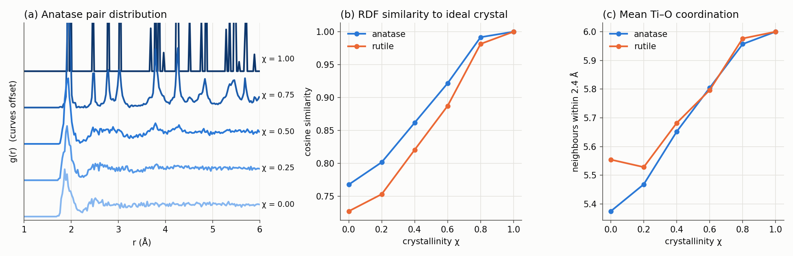

# tio2gen

[](https://github.com/mberdakin/tio2gen/actions/workflows/tests.yml)


Generate periodic **TiO2 supercells** — anatase or rutile — with a single
**crystallinity** knob that goes continuously from a perfect crystal to an
amorphous-like network. Structures are written as **XYZ**, **CIF** and
**GEN** (the [DFTB+](https://dftbplus.org) geometry format), ready to be used
as starting points for DFTB+ or other atomistic simulations.

Built on the [Atomic Simulation Environment (ASE)](https://wiki.fysik.dtu.dk/ase/).



*(a) Pair distribution function of an anatase supercell as the crystallinity χ
is lowered. (b) Similarity of g(r) to the ideal crystal and (c) mean Ti
coordination, for both phases. Generated with
[`examples/crystallinity_sweep.py`](examples/crystallinity_sweep.py).*

## Features

- **Two polymorphs**: anatase (I4₁/amd) and rutile (P4₂/mnm), built from
  experimental lattice parameters.
- **Arbitrary supercells**: `n` or `(nx, ny, nz)` repetitions of the
  conventional cell.
- **Crystallinity parameter χ ∈ [0, 1]** with spatially correlated disorder
  (amorphous domains next to crystalline grains), preserving composition and
  density.
- **Physically sensible disordered structures**: a built-in Matsui–Akaogi
  potential quench restores realistic Ti–O bonding.
- **Three output formats**: extended XYZ (with lattice and a per-atom
  `amorphous` flag), CIF, and DFTB+ GEN.
- **Reproducible**: every random step is controlled by a seed.
- Python API + command-line tool, tested with `pytest` and CI.

## Installation

```bash
git clone https://github.com/mberdakin/tio2gen.git
cd tio2gen
pip install -e .            # add ".[dev]" for tests, ".[examples]" for plots
```

## Quick start

### Command line

```bash
# Perfect 3x3x2 anatase supercell, all formats, into ./structures
tio2gen --phase anatase --supercell 3 3 2

# Rutile 4x4x6, three degrees of crystallinity, reproducible
tio2gen -p rutile -s 4 4 6 -c 1.0 0.6 0.2 --seed 42

# Only the DFTB+ geometry, several amorphous domains
tio2gen -p anatase -s 4 -c 0.5 --domains 4 -f gen -o dftb_inputs
```

Files are named after their parameters, e.g.
`rutile_4x4x6_c0.60_seed42.gen`. Run `tio2gen --help` for all options.

### Python

```python
from tio2gen import build_structure, write_structure

atoms = build_structure(
    phase="rutile",        # "anatase" | "rutile"
    supercell=(4, 4, 6),   # or a single int
    crystallinity=0.6,     # 1 = crystal, 0 = fully disordered
    seed=42,
)
write_structure(atoms, "structures", formats=["xyz", "cif", "gen"])
```

`atoms` is a regular `ase.Atoms` object, so anything in ASE (viewers,
calculators, other file formats) works on it directly.

## How the crystallinity parameter works

Starting from the perfect supercell, a structure with crystallinity χ is built
in four steps (see [`tio2gen/disorder.py`](tio2gen/disorder.py)):

1. **Amorphous region.** A fraction `1 − χ` of the atoms is selected around
   `n_domains` random seed points, using minimum-image distances. Disorder is
   therefore spatially correlated: with one domain you get an amorphous pocket
   embedded in a crystalline matrix; with more domains the disorder spreads out.
2. **Randomisation.** Atoms in the amorphous region get Gaussian displacements
   (`amorphous_sigma`, 0.8 Å by default). Crystalline atoms can optionally get
   small thermal-like displacements (`thermal_sigma`).
3. **Overlap removal.** An iterative push-apart step enforces minimum
   Ti–O / O–O / Ti–Ti distances so no two atoms overlap. Crystalline atoms at
   the interface may be nudged too, mimicking grain-boundary strain.
4. **Quench.** A short FIRE minimisation (`relax_steps`, 300 by default) with
   the Matsui–Akaogi TiO2 potential. Without it, distances pile up at the
   hard-core values and Ti is under-coordinated; with it, the disordered
   network recovers realistic Ti–O bonds.

Atoms are only moved, never added or removed, and the cell is fixed, so
composition and density are those of the parent phase. χ = 1 returns the
exact crystal. The per-atom `amorphous` flag is kept in the XYZ file, so the
two regions can be coloured separately in a viewer such as OVITO.

### The interatomic potential

[`tio2gen/potential.py`](tio2gen/potential.py) implements the
Matsui–Akaogi potential as an ASE calculator:

U(r) = qᵢqⱼ / r + Aᵢⱼ exp(−r / ρᵢⱼ) − Cᵢⱼ / r⁶

The long-range Coulomb term uses the damped shifted force (DSF) method, a
real-space alternative to Ewald summation, and pairs are tracked with a
Verlet neighbour list. Forces are validated against finite differences in the
test suite.

## Validation

| Check | Result |
|---|---|
| Unit cells | Ti4O8 (anatase), Ti2O4 (rutile); densities 3.89 and 4.25 g/cm³ |
| Perfect crystals | every Ti six-fold coordinated; residual Matsui–Akaogi forces < 0.3 eV/Å |
| Crystallinity sweep | g(r) similarity to the crystal decreases monotonically with χ |
| Disordered structures | composition, cell and minimum distances preserved |
| Potential | analytic forces match finite differences; rutile more stable than anatase |
| I/O | XYZ, CIF and GEN files read back with ASE with the same cell and formula |

Run the test suite with:

```bash
pytest -q
```

## Limitations and next steps

- The quench is a local minimisation, not a melt–quench molecular dynamics
  run. The disordered structures are good *starting points*; for production
  work anneal them with DFTB+ (or classical MD) before computing properties.
- Density is inherited from the parent crystal. Amorphous TiO2 is typically
  less dense (≈ 3.8–4.0 g/cm³); cell rescaling would be a natural extension.
- Possible additions: brookite, oxygen vacancies / dopants, slabs for surface
  calculations.

## Project layout

```
tio2gen/
  phases.py      crystallographic data and unit cells
  builder.py     high-level build_structure() API
  disorder.py    crystallinity model (regions, displacements, overlaps, quench)
  potential.py   Matsui–Akaogi potential as an ASE calculator
  analysis.py    g(r), coordination numbers, RDF similarity
  io.py          XYZ / CIF / GEN writers
  cli.py         command-line interface
tests/           pytest suite
examples/        crystallinity sweep figure
```

## References

- J. K. Burdett *et al.*, *J. Am. Chem. Soc.* **109**, 3639 (1987) — anatase and rutile structures.
- M. Matsui and M. Akaogi, *Mol. Simul.* **6**, 239 (1991) — TiO2 interatomic potential.
- C. J. Fennell and J. D. Gezelter, *J. Chem. Phys.* **124**, 234104 (2006) — damped shifted force electrostatics.
- A. H. Larsen *et al.*, *J. Phys.: Condens. Matter* **29**, 273002 (2017) — ASE.

## License

MIT — see [LICENSE](LICENSE).
